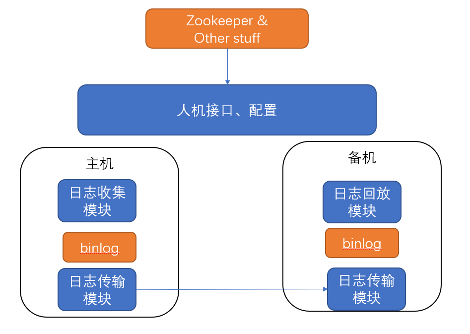
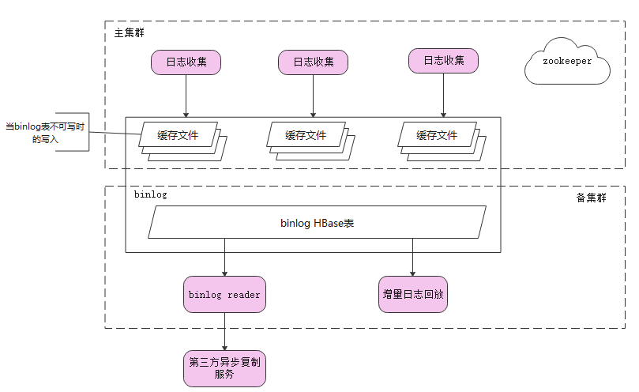
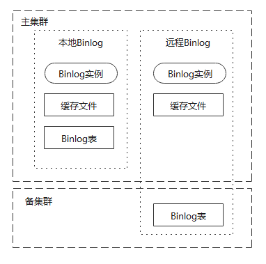
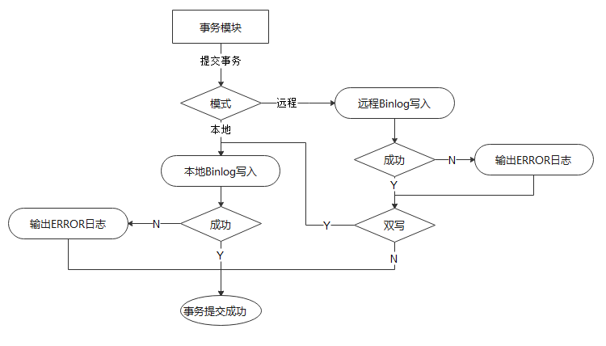
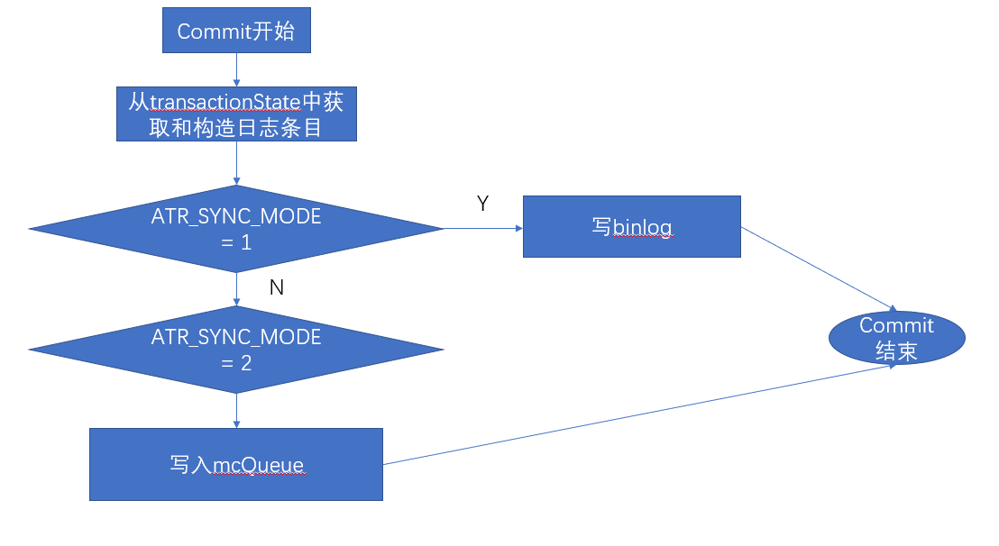
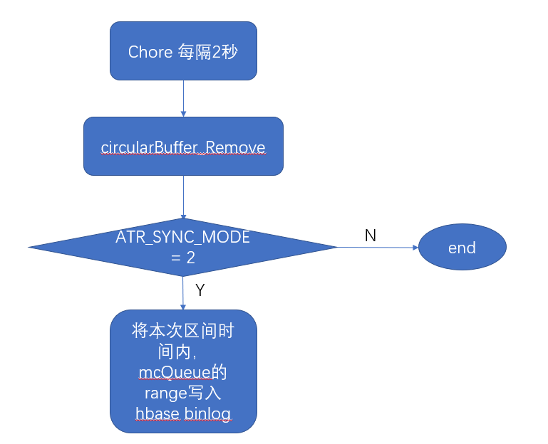
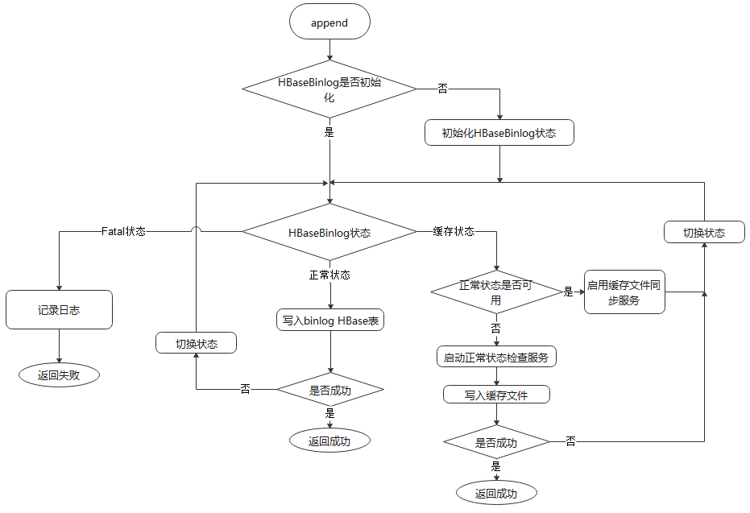
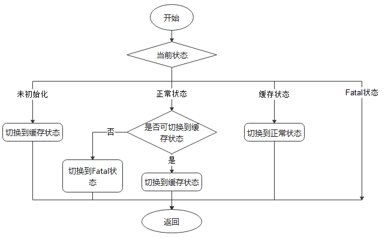
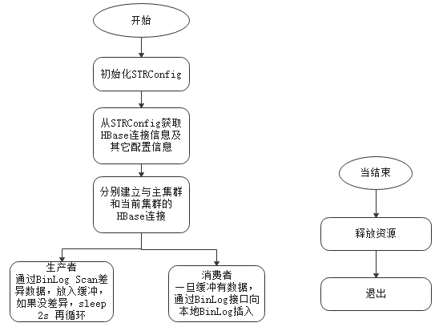
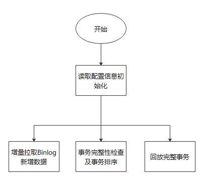

# 异步多数据中心复制详细设计

## 背景
在远距离两数据中心或者更多数据中心的情况下，受网络带宽、延时及网络波动等影响， 采用同步复制的方法很难保证主集群的性能。在样的背景下我们决定开发基于异步复制的多数据中心功能。基本的思想是允许从数据中心的数据有限的滞后于主数据中心， 这样主集群在事务写和提交的时候就不必等从集群成功才继续从而保证业务的性能。

## 一期目标
支持基本功能。
收集二期需求。

## 约束
这一阶段异步xdc的应用场景是用于复制在线的增量数据，用异步的方式做数据增量备份。

## 整体设计
钱库的异步多数据中心复制功能采用如下的整体设计，主要模块包括
* 人机交互接口和配置模块
* 日志收集模块
* 日志回放模块
* 日志传输模块



日志采用单一HBase表存储，我们称之为binlog。这个术语可以改变，因为binlog来自MySQL，我们可以换一个称呼。比如MutationLog，现在我先用binlog。

日志收集模块负责将已经提交的数据变化记入binlog。

日志传输模块负责将主机的binlog完整可靠地传输到备机，并写入备机的binlog。

日志回放模块负责读取binlog并在备机进行日志回放.

### binlog本机写入架构


### binlog异机写入架构


### HBaseBinlog双写
#### 实例分布

#### 写入流程


#### 使用配置
* bcstr: 如果需要使用远程binlog需要配置该选项。
* mode: 配置远程模式或是本地模式。
* dual: 配置是否双写。

## 人机交互接口和配置模块
基本复用现有同步XDC的接口，新增部分异步XDC的接口。

### 不用修改的接口
* xdc_peer_add
* xdc_peer_delete
* xdc_peer_check

### 新增接口
#### 异步xdc服务初始化配置
* atrxdc_init
该脚本用于初始化binlog以及相关配置，用于初始化异步xdc的相关配置。

* 启用atrxdc功能
atrxdc -enable

* 停止atrxdc功能
atrxdc -disable

* 检查atrxdc配置是否生效
atrxdc -checkconf

#### 启动异步XDC日志增量复制服务
* atrxdc_start_log_sync
#### 停止异步XDC增量日志复制服务
* atrxdc_stop_log_sync
#### 启动Binlog增量回放服务
* atrxdc_start_replay [bcstr]
#### 停止Binlog增量回放服务
* atrxdc_stop_replay
#### 启动异步XDC日志增量复制回放服务
* atrxdc_start
#### 停止异步XDC服务
* atrxdc_stop
#### 检查异步XDC状态
* atrxdc_check
#### 异步XDC集群角色
* atrxdc_set_role {primary | secondary }
primary表示当前集群作为主集群。
secondary表示当前集群作为从集群。允许对从集群异步复制属性的表进行查询， 但不允许修改。设置集群角色后需要重启(为什么不直接做不用重启的功能？考虑性能问题及缓存问题， 比如执行计划缓存导致主从的切换可能不生效)。

* atrxdc_get_role
获取当前集群的角色。

#### binlog相关命令行接口
* atrxdc -set bp {partition number}
这条命令会重构binlog表－－'TRAF_RSRVD_5:TRAFODION._DTM_.TRAFODION_BINLOG'， 使用partition_number作为新的分区数
binlog里的数据是与partition num绑定的， 不能只简单修改某个参数。现在方式是在确保binglog已经完成复制的情况下， drop再重新create。如果在完成数据复制之前执行这个命令会导致主从集群的数据不一致，所以这个命令是一个危险操作。
* atrxdc -sl
这条命令用于从hbase shell查询binlog内容。
* atrxdc -cl
这条命令用于清理binlog的内容。
* atrxdc -enable
这条命令用于启用异步XDC的功能
* atrxdc -disable
这条命令用于停用异步XDC的功能
* atrxdc -set mode
这条命令用于设置异步复制模式
* atrxdc -get mode
这条命令用于打印当前系统的异步复制模式
* atrxdc -set bwsz
这条命令用于设置binlog write buffer size的大小，单位是byte。
* atrxdc -get bwsz
这条命令用于获取binlog write buffer size的大小。
* atrxdc -set bcstr
这条命令用于设置存储binlog的hbase集群连接信息.
* atrxdc -get bcstr
这条命令用于获取存储binlog的hbase集群连接信息.
* atrxdc -set skipwal
这条命令用于设置写Binlog是否跳过写WAL
* atrxdc -get skipwal
这条命令用于获取当前Binlog的WAL选项
* atrxdc -h
查看atrxdc支持的所有命令及使用方法.

## Binlog收集模块
### 基本思路
在事务提交的第二阶段，将变化的数据写入内存队列。然后定期将内存队列刷入hbase的binlog表。
目前代码中已经实现了内存队列，被称为mcQueue，这部分可以重用。
mutationCapture2.MC2_doBufferAppend

目前代码中也已经有一个Chore线程，MC2TransactionsChore，定期调用MC2_doChoreOperation（）将内存队列写入mutation file。可以利用这个机制将内存队列的内容写入hbase。

如果将数据缓存到内存中，那么就存在丢失的风险。比如Chore还未能将内存刷入磁盘的时候宕机。因此，我们引入配置选项，atr_sync_mode。
ATR_SYNC_MODE = 1  本机模式
ATR_SYNC_MODE = 2  异机模式

在本机模式下，commit的数据写入buffer，定期刷入binlog，日志写入有一定延迟。

在异机模式下，commit的同时，直接写入binlog，主要用于binlog配置为异机的情况下。保证RPO=0

### Binlog收集对象
带有增量属性的表

### 工作流程
#### Commit流程



针对带有IB属性的表
#### Chore流程



Chore线程每隔两秒唤起一次，将缓存在mcQueue中的信息都写入hbase binlog

### 异机存储binlog
为了减少同机binlog收集带来的开销影响主集群的性能， 同时也为了支持更灵活的灾备方案，允许用户配置远程hbase集群为binlog的写入集群。

#### 用户接口
atrxdc -set bcstr ip[:port]
atrxdc -get bcstr

#### Binlog写入流程


#### Binlog状态切换


#### 遗留问题
* 1. 大事务如何更好地支持，如果一个事务更新50万行数据，单个日志条目会很大，是否存在问题？
* 2. 如果用户创建既有IB属性又有同步属性的表会有什么问题？(TODO: 通过SQL语法限制这种用法).
* 3. 切换角色需要重启从集群是否影响RPO，RTO?

### Binlog传输
如果用户选用本机写入binlog的异步复制架构，需要在备机启用分布式增量日志同步服务拉取主集群的增量日志。

#### AsyncXDCManager
在开始阶段，AsyncXDCManager负责读取相关配置信息，并根据主集群的HBaseBinlog分区在合适的从集群选择合适的节点运行AsyncXDCWorker.

##### AsyncXDCManager的执行流程


#### AsyncXDCWorker
一个AsyncXDCWorker只负责复制与回放一个主集群的HBaseBinlog分区。

##### AsyncXDCWorker的执行流程



在消费者线程里完成日志的回放与写本地Binlog。

#### 启动脚本

最终调用AsyncXDC完成相应功能。

##### start-async-xdc-manager.sh

##### start-async-xdc-worker.sh

##### async-xdc-daemons.sh

##### async-xdc-daemon.sh

### Binlog回放
Binlog回放服务读取指定的binlog进行回放, 使用的类是HBaseBinlogReplayer。

#### 回放执流程 


#### Binlog回放的断点继续
TBD

### Binlog格式

日志为native hbase表
* 表名：  TRAF_RSRVD_5:TRAFODION._DTM_.TRAFODION_BINLOG
* Family : mf
* Qual :  mq

每一行对应一个日志条目，一个完整事务可能由一条或者多条日志组成。
Hbase是key/value，即rowkey和payload。具体这两个的设计在下面进行描述。
#### Rowkey设计

rowkey为18字节的byte[]
* 前4字节 : salt               -- 使用TM的node number (0, 1, 2, ...)根据节点数映射得到。
* 之后8字节 ： writeID         -- 每个节点从1开始的唯一且连续的序列。
* 再之后4字节 : regionInfo     -- 记录region名的hash值。
* 最后2字节 ： totalNum        -- 一个事务的总日志条数。

##### commitID的构成
使用TM node的System.currentTimeMillis() * 1000 + seqno


#### Payload设计
TransactionMutationMsg转换为binary作为payload

```
message TransactionMutationMsg {
  required int64 txId = 1;
  required string tableName = 2;
  repeated MutationProto put = 3;
  repeated MutationProto delete = 4;
  repeated bool putOrDel = 5;
  required int64 startId = 6;
  required int64 commitId = 7;
  optional int32 tableCDCAttr = 8;
  optional bool isComplete = 9;
}
```

### HBaseBinlog模块
负责处理HBaseBinlog的操作。

Append： 增加日志
Scan :  读取日志

### DDL异步复制属性
目前认为有IB属性的表就具有异步复制属性。


### 系统运行日志
系统生成的日志位于$TRAF_LOG目录下trafodion.atrxdc.java.xxx.log
设置日志级别的配置文件位于$TRAF_CONF目录下


### 主从集群角色的切换
标识主从集群的方式为 atrxdc_set_role { primary|secondary }， 这个命令会在执行命令的节点的zookeeper的/trafodion/multi_dc/atr/role写入信息，并将zookeeper信息推到对端集群。实际的角色信息会在region server启动的时候读到TrxRegionEndpoint, 所以命令执行完成后需要重启数据库让配置生效。不允许在primary集群启动异步复制服务， 对secondary集群， SQL修改IB属性的表会从HBase层抛异常， 读不受影响。

### DDL语句复制
#### DDL的日志收集
   日志收集通过"_XDC_MD".XDC_DDL表收集。

#### DDL的日志收集
   日志收集通过"_XDC_MD".XDC_DDL表收集。

#### DDL日志回放
   TBD

### LOB复制
   TBD
### sequence复制
   sequence是全局唯一序列，可能不完全连续，但是不能重复。复制sequence是为了业务迁移到从集群运行的时候可以正常使用sequence不会拿到重复的sequence。
#### SEQUENCE的日志收集
   日志收集通过"_XDC_MD".XDC_SEQ表收集。

#### sequence复制的设计
sequence不同于表数据，为适应不同的场景，其底层实现也不同，为了支持异步XDC的功能也不能降低sequence的性能，所以sequence的复制也不能像表数据一样， 每条更新写一条binlog。基于以上，我们新增了TRAFODION."_XDC_MD_".XDC_SEQ的表用于统一不同sequence实现的binlog写入。在写入的算法上sql层会提前cache一段连续可用的sequence, 然后把cache的sequence的最大值的下一𠆤sequence写入log。异步XDC服务把日志复制并回放到从集群，在从集群开始服务之前从TRAFODION."_XDC_MD_".XDC_SEQ的数据将从集群相关的sequence更新为可用的sequence。

新增命令行接口:
* atrxdc -replayseq 用于手动回放sequence

#### sequence复制的使用
1. 创建/删除异步XDC系统表的语法是
initialize trafodion, create/drop xdc metadata;
目前的测试可以先手动创建，等到功能测试可用，就可以把上面的语句加到安装脚本里面
2. 对于非order的序列，只在cqd TRAF_SEQUENCE_USE_DLOCK 'on'或者 TRAF_SEQUENCE_USE_DTM 'on'的时候有效
3. 对于非order的sequence，在需要获得nextval的时候，如果cache用完之后，需要去元数据表里面取nextval, 这个步骤会同时更新"_XDC_MD_".XDC_SEQ这个表里面的next_value值,next_value会比当前session所能用cache取到的最大值+1。
4. 对于order sequence, 每次获得的nextval 符合 nextval % (incrementby * cache) == 0, 你们就会把当前hbase原生表的里面的值加上incrementby * cache的值更新到"_XDC_MD_".XDC_SEQ
5. 执行'atrxdc_set_role primary'切换集群角色使用从集群sequence生效。
6. sequence想要支持xdc, 在创建sequence的时候需要加上SYNCHRONOUS REPLICATION选项，比如 create sequence seq1 SYNCHRONOUS REPLICATION;

### HA支持
TBD

### 数据一致性检查
为保证异步XDC数据传输的高性能，我们将Binlog的传输与回放任务分配给集群的若干节点去执行，执行过程不做同步操作， 完全并发执行。数据一致性检查通过检查从集群的binlog的每个事务包含的LOG分支是否完整，同时检查从集群与主集群的binlog条数是否相等。

#### 从集群的一致性检查
从集群的一致性检查包括两个机制
* 每个日志回放任务检查对应分区的write ID连续性
write ID的连续性用于确保Binlog的完整性。
* Replayer检查每个事务包含分支记录的完整性
在从集群， Replayer负责检查每个事务包含的LOG分支是否完整， Replayer在回放的时候检查日志是否收集了TotalNum条数的日志，只有收集了足够的日志才进入真正的回放流程。

### binlog清理
为了避免binlog在使用过程中无限增长，需要提供接口给用户清binlog。清理binlog是通过delete的方式实现，由于delete本身也是写操作所以在清除binlog后也需要对binlog做compaction的操作。
用例：
* atrxdc -cl "2020/10/03 16:30:00"
* atrxdc -cl 1 day ago
* atrxdc -cl 2 hour ago

### 参数与性能
#### HBase参数设置
binlog会增加HBase的RPC请求压力，特别是在本机模式下，为了让binlog能正常运行并能获得比较好的性能，需要调整HBase的一些参数， 下面是可能需要调整的一些参数及在4节点集群的建议值。
* hbase.master.handler.count
256
* hbase.regionserver.handler.count
460
* hbase.ipc.server.num.callqueue
300
* hbase.regionserver.executor.openregion.threads
50
* hbase.master.executor.openregion.threads
50


### 应用场景
#### 主库已经支行一段时间，需要启用备库功能，要求主库业务不停。
##### 方案
1. 主库启用atrxdc功能
2. 主库做在线全备
3. 导出备份到备库
4. 备库做全量恢复
5. 备库启用异步xdc服务拉取
#### 拉取方式与推送方式的切换
##### 方案1
1. 主群切换到推送写binlog的模式
2. 备集群的异步服务不停
3. 备集群继续同步数据并检查writeID的连续性，不拉取已经存在的数据。
