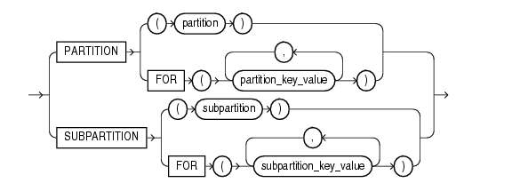

# 兼容Oracle的分区表

## 语法

### DDL

> to be write there

### DML

需要在语句中指明所选择的partition，语法为:

`DML_TYPE table_name PARTITION_CLAUSE`

* `DML_TYPE`是主要支持的DML语句，主要包含`insert`, `update`, `delete`, `select`。
* `table_name`为表名
* `PARTITION_CLAUSE`是指定`partition`的语法



语法有指定分区与分区建两种，其中有需要注意的点。
就指定分区来说。在一个语句中只能指定一个分区，无法同时指定多个分区，且指定的分区必须存在，以下是简单的例子：
```sql
table ta 有分区P1, P2, 使用时需要遵循上述条件，下面的语句是正确的。
select * from ta partition(p1);
select * from ta partition(p2);
但是下面的语句是错误的，
select * from ta partition(p3);         -- P3不存在
select * from ta partition(P1， p2);    -- 无法指定多分区
```

对于指定分区键来说，需要确定的是分区键必须在我DDL定义的分区范围之内，如果有多个分区建，则第一个值需要满足此要求，以下是简单的例子：
```sql
如ta有分区P1, P2,，具体范围为：
partition p1 values less than(1000, 100),
partition p2 values less than(2000, 200)
则下面的语句是正确的：
select * from ta partition for(100, 50);                        --  在分区P1的范围内，所以使用的是P1分区
select * from ta partition for(1050, 150);                      --  在分区P2的范围内，所以使用的是P2分区
select * from pt_range_test233 partition for (10, 50000);       -- 此语句也是正确的，第一个分区建在P1内

下面的语句则不满足要求
select * from pt_range_test233 partition for (100000, 50);

```

############ 元数据表 #####################################

为了防止歧义，说明一下分区表和分区。
eg.
create table pt (c1 int ,c2 int,c3 int)
partition by range(c1)
(
partition p1 values less than (10),
partition p2 values less than (20),
partition p3 values less than (30)
);

分区表：pt
分区：p1, p2, p3

分区表是一张base table(bt), 和现有的bt的差别有两点：
1. "_MD_".objects flags那一列，用MD_PARTITION_TABLE_V2来标识。
2. 没有对应的hbase表

每个分区对应一张base table, 用MD_PARTITION_V2来区别，存放实际数据。

在"_MD_"目录下新增了两张元数据表，TABLE_PARTITION_PROPERTY和TABLE_PARTITIONS。TABLE_PARTITION_PROPERTY用来描述partition和subpartion的属性，比如分区方式，基于什么列; TABLE_PARTITIONS用来描述具体每个分区的细节。

TABLE_PARTITION_PROPERTY
{
  TABLE_UID                   分区表的uid
  PARTITION_TYPE              分区方式 0:不分区  1:HASH  2:RANGE 3:LIST
  PARTITION_COLUMN            分区列
  PARTITION_COLUMN_NUM        分区列的个数
  PARTITION_INTERVAL          兼容interval语法，目前不支持
  PARTITION_AUTOLIST          兼容automic语法，目前不支持
  SUBPARTITION_TYPE           子分区分区方式
  SUBPARTITION_COLUMN         子分区列
  SUBPARTITION_COLUMN_NUM     子分区分区列的个数
  SUBPARTITION_INTERVAL       兼容interval语法，目前不支持
  SUBPARTITION_INTERVAL       兼容automic语法，目前不支持
  FLAGS                       默认0，暂时不用 
}

TABLE_PARTITIONS
{
  PARENT_UID                  对于（一级）分区，存放分区表的uid, 对于子分区，存放对应（一级）分区的uid
  PARTITION_NAME              分区名
  PARTITION_UID               分区对应的表的uid
  PARTITION_LEVEL             P:（一级）分区    S:子分区
  PARTITION_ORDINAL_POSITION  第几个分区
  PARTITION_EXPRESSION        分区的list值或者最高值
  STATUS                      valid或者invalid
  READONLY                    暂时不用
  INMEMORY                    暂时不用
  DEF_TIME                    创建（更改）时间
  FLAGS                       默认0
  V1~V4                       保留，暂时不用
}
########### END--元数据表---END ############################

```
global    index : not support
local     index : create [unique] index index_name on table_name (cols) local;
partition index : create [unique] index index_name on table_name (cols) partition (x);


* 如果表不是partition表，指定local或者报错【1229】CREATE PARTITION INDEX ON NOT A PARTITION TABLE
* 如果表是partition表，未指定local或者partition (x)会报错，partition上的index类型暂时必须明确指定
* 同时指定local和partition (x)会报错
* 只支持unique和普通index，其他index会报错【3242】   
* 暂时不支持populate index 和enable/disable index

local     index：
create [unique] index index_name on table_name (cols) local;
	首先会建立一个没有实体的index，type为MD_IS_LOCAL_BASE_PARTITION_FLG
	接着会对每一个partition使用createSeabasePartitionIndex函数创建index，type为MD_IS_LOCAL_PARTITION_FLG
	
	createSeabasePartitionIndex使用的内部语法为：
		create [partition local|global] [unique] index index_name on table_name (cols);
	
partition index : 
create [unique] index index_name on table_name (cols) partition (x);
	会根据table和partition替换目标表名称，然后执行正常的建立index的流程，此时type为MD_IS_NORMAL_INDEX_FLG

	create table like:
		create table like 会携带local index的信息，
			外部create table like的时候，会使用没有实体的index的描述信息建立index。普通的index则根据具体的分区上的index描述信息建立index
			内部使用create partition table like建立index的时候，由于目标表是虚表且只有local index的描述信息，所以只会建立local index，不会建立普通的index，index的描述信息会使用上述createSeabasePartitionIndex的语法结构生成。

内部使用
- partLocalBaseIndex判断是否为虚表上的local index
- partLocalIndex判断是否为分区上的local index
- partGlobalIndex判断是否为global index


```